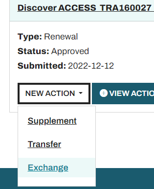

# Getting Access to Jetstream2

## Outline
- [Getting Access to Jetstream2](#getting-access-to-jetstream2)
  - [Outline](#outline)
  - [Terminology](#terminology)
  - [Overview](#overview)
  - [Create an ACCESS Account](#create-an-access-account)
  - [Apply for an ACCESS Allocation](#apply-for-an-access-allocation)
    - [Types of Allocations](#types-of-allocations)
    - [Additional Allocation Notes](#additional-allocation-notes)
  - [Exchange Credits](#exchange-credits)
    - [What Will You be Using Your Credits For?](#what-will-you-be-using-your-credits-for)
    - [Walkthrough - Exchanging Credits for Jetstream2 CPU](#walkthrough---exchanging-credits-for-jetstream2-cpu)
  - [Add Users](#add-users)
    - [Allocation Managers (Optional)](#allocation-managers-optional)
    - [Adding Users to a Resource](#adding-users-to-a-resource)

## Terminology
*   ACCESS - Advanced Cyberinfrastructure Coordination Ecosystem: Services \& Support - One-stop shop for advanced cyberinfrastructure needs of researchers and educators (I'm sure there's some official jargon to fill in here).
*   Project - Another word for an allocation registered with ACCESS. Project IDs have the form ABC123456
*   Resource - An advanced computational system that is part of the ACCESS ecosystem. Jetstream2 is one the many resources available to ACCESS users.
*   Resource Provider - The institution or group that manages a specific resource (That’s us!)

## Overview
The first portion of this guide involves interacting with ACCESS, an NSF funded collaboration that facilitates free access to advanced cyberinfrastructure for researchers and educators. Jetstream2 is one of [many resources](https://access-ci.atlassian.net/wiki/spaces/ACCESSdocumentation/pages/129141407/Resource+Providers){target=_blank} available to ACCESS users, but in order to use any of the resources managed by ACCESS, you must be a registered user with an active ACCESS allocation. We will start by walking you through how to create an ACCESS account and apply for an allocation. If you already have an allocation, you can skip to [Exchanging Credits](#exchange-credits).

The first few sections of this guide draw heavily from the [ACCESS Getting Started](https://access-ci.atlassian.net/wiki/spaces/ACCESSdocumentation/pages/129139077/Getting+Started){target=_blank} documentation. Here we will only be covering the essentials needed to get started on Jetstream2, but we highly recommend reading the official documentation for further details, especially if you plan to use other ACCESS resources.

## Create an ACCESS Account

The first step is to create an [ACCESS portal](https://identity.access-ci.org/new-user){target=_blank} account. If you are affiliated with a University, we recommend choosing *Register with an existing identity*.

Please note that **every member** of a project that wants access to Jetstream2 must make an ACCESS account. This means both the PI of a project and any researchers or students that will be added to the project.

## Apply for an ACCESS Allocation

Please note that the rest of this guide must be completed by the PI of a project! Right now you are probably asking yourself, "Who is eligible to be a PI?" The answer to this question and many more can be found in the [Policies FAQ](https://allocations.access-ci.org/ramps-policies-faqs){target=_blank} over on the ACCESS site. This section will likely be the most time consuming part of this guide and you are likely to have many questions. There is a lot of information to cover about allocations, but the point of this guide is to be brief, so instead of covering it all here, we will point you to useful links like the one above where a lot of this information is already covered. We highly recommend you read through the docs here and those that we link thoroughly. When you are ready to submit your allocation request, come back here and follow the link below.

[Submit your allocation request](https://allocations.access-ci.org/opportunities){target=_blank}

If this is all too much for you and you just want to get your feet wet to see what Jetstream2 has to offer, you should follow the link above and submit an *Explore ACCESS* request. If you find later on that you need more compute time, you can "upgrade" your project to a higher allocation tier. Otherwise, keep reading on to learn more about allocations.

### Types of Allocations

There are four tiers of allocations. Each subsequent tier gives you more total compute time, but requires more justification to obtain. The table below briefly summarizes the upper limit of ACCESS credits obtained for each tier. You can think of ACCESS credits like a monopoly money that you can use to exchange for compute time on any ACCESS resource (like Jetstream2!). Every resource provider handles the conversion from ACCESS credits to compute time on their machines differently, but all you need to know now is that more credits = more compute time. If you want more details on how Jetstream2 handles your credits see [ACCESS Credits and Jetstream2](https://docs.jetstream-cloud.org/general/access/){target=_blank}. 

| Allocation Tier   | ACCESS credits |
| ----------------- | -------------- |
| Explore ACCESS    | 400,000        |
| Discover ACCESS   | 1,500,000      |
| Accelerate ACCESS | 3,000,000      |
| Maximize ACCESS   | No Upper Limit |

More detail on each of these allocations, including their requirements, tips for writing proposals, and even example proposals, can be found in the official [ACCESS documentation](https://access-ci.atlassian.net/wiki/spaces/ACCESSdocumentation/pages/154927214/Prepare+requests){target=_blank}. 

### Additional Allocation Notes

*   Allocations are typically tied to grants. You are authorized to use ACCESS resources for the duration of the grant. You can have as many allocations as you have grants, plus one allocation not tied to a grant. If your allocation is not associated with a grant, it will last for 12 months with the possibility for renewals.
*   *Explore ACCESS* allocations can take up to 2 days to be approved. Each tier above can take even longer to be approved. You can find more details at the [Policies FAQ](https://allocations.access-ci.org/ramps-policies-faqs){target=_blank}.

Once your allocation is approved, you should see your title, project ID, and available ACCESS credits at the [Allocations Usage](https://allocations.access-ci.org/allocations/summary){target=_blank} page. If this is a brand new allocation, the only resource you should see in the table below your project is *ACCESS credits*.

## Exchange Credits

### What Will You be Using Your Credits For?
Congratulations! You now have an active allocation with a bunch of unused *ACCESS credits*. How do you actually use these credits? The next step is to exchange your ACCESS credits with an ACCESS resource. Since you are here, that means you want to use Jetstream2. When you exchange your credits to a Jetstream2 computational resource, they will be converted to Service Units (SUs). Other resources may call their units differently and have different exchange rates. For simplicity, we've aligned our SU value such that ***1 ACCESS Credit = 1 Jetstream2 SU***.

There are three different Jetstream2 resources for which you can exchange credits for SUs, and one which you can exchange credits for storage. This guide will be focusing on the three computational resources. By default, you will have access to 1 TB of storage, which should be more than enough to get started. If you want to learn more about the storage resource, please see [Jetstream2 Storage](https://docs.jetstream-cloud.org/general/resources/#jetstream2-storage){target=_blank}. The three computational resources are:
*   ***Jetstream2*** (CPU only)
*   ***Jetstream2 Large Memory***
*   ***Jetstream2 GPU***

!!! Note "Jetstream2 Resources"

     ***Please note that these are all separate resources under ACCESS. You must select Jetstream2 (CPU), Jetstream2 GPU, or Jetstream2 Large Memory when spending credits to have access to these JS2 resources. Having access to one does NOT yield access to all. ***

Most researchers will be able to satisfy their needs using the CPU only resource. If you know you will need a GPU for analysis, you might consider exchanging resources for both the CPU and GPU resources. GPU instances consume SUs quite rapidly, so may want to do your setup on a CPU instance to preserve SUs. You can see a full list of the types of machines you will be able to create as well as their SU cost per hour at [VM Sizes and configurations](../general/vmsizes.md){target=_blank}.

### Walkthrough - Exchanging Credits for Jetstream2 CPU

1.  Go to [Manage my Projects](https://allocations.access-ci.org/requests){target=_blank}, find your project, then click **NEW ACTION > Exchange**

2.  Select *Indiana Jetstream2* from the drop down list and then click *Add Resource*. A new row should appear.
3.  Choose your *Desired Balanced*. If you just want to try out Jetstream2, 10,000 is a good amount to get your feet wet. This would let you run an **m3.quad** (8 CPU cores and 32 GB of RAM), similar to a higher-end laptop or research workstation, for 1250 hours, or about 50 days. If you find that Jetstream2 is the right resource for you, just request more SUs later. 
4.  Enter a comment in the field provided briefly explaining your request and how you intend to use the resource. This is useful for us to see whether the resource you picked is right for you. We rarely deny requests, and if we do it's because we think you would be better off spending your ACCESS credits elsewhere.
5.  Click Submit! Now you just have to wait for us to approve the exchange. We try to be very diligent about approving requests quickly. You will receive an email as soon as we approve the request, and another email after the system has processed the request. The whole process usually takes between 1-2 business days.
6.  In the meantime, make sure all of your collaborators (anyone else that you want to add to the project) have made an ACCESS account. The next step involves adding them to your project and to your resource. You can only add users that are registered with ACCESS

## Add Users

If you are the only one who will be accessing this project, then you can skip this step and move on to [Logging in to Jetstream2]().

However, if you are part of a collaboration, you will need to add users to each resource they need access to. This means that if you are using Jetstream2's CPU, GPU, and Large Memory resources, you would need to add users to all three resources.

Start by going to the [User Management](https://allocations.access-ci.org/user_management){target=_blank} screen and selecting the project you created earlier.

### Allocation Managers (Optional)
By default, only the PI will be an *allocation manager*. If you wish to delegate management to somebody else in your project, you can add them as an allocation manager. Allocation Managers can submit management requests (extensions, supplements, adding users, etc.) in support of the project on your behalf. 

To add an allocation manager, click **+ADD ALLOCATION MANAGER**, then search for the users (by their ACCESS ID) you want to add. You can add multiple users at once. When you are done selecting all the users you want, click **SAVE CHANGES**.

### Adding Users to a Resource
To add a user to your resource(s), click **+ADD USERS TO RESOURCES**, then search for the users (by their ACCESS ID) you want to add. You can add multiple users at once. When you are done selecting all the users you want, uncheck any resources that you *don't* want those users to get access to. Finally, click **SAVE CHANGES**.

If you are following along with this guide, then you will only have one resource that you can add users to, *Indiana Jetstream2*. If at a later date you decide to add more resources, you will have to repeat this step to add users to those resources. Users will **not** automatically get access to new resources you exchange credits for.

!!! Note "Adding Users"

    Please note that it can take up to four hours for users added to a resource to become active. Please give the system time to process before you tell your users to proceed with the next step. 

Congratulations!!! You and your collaborators should now have access to Jetstream2. In the next section we will go over how to log in, create your first instance, and install your favorite programs.

