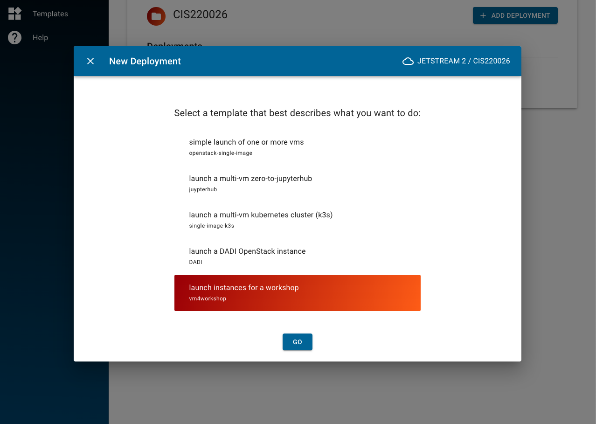
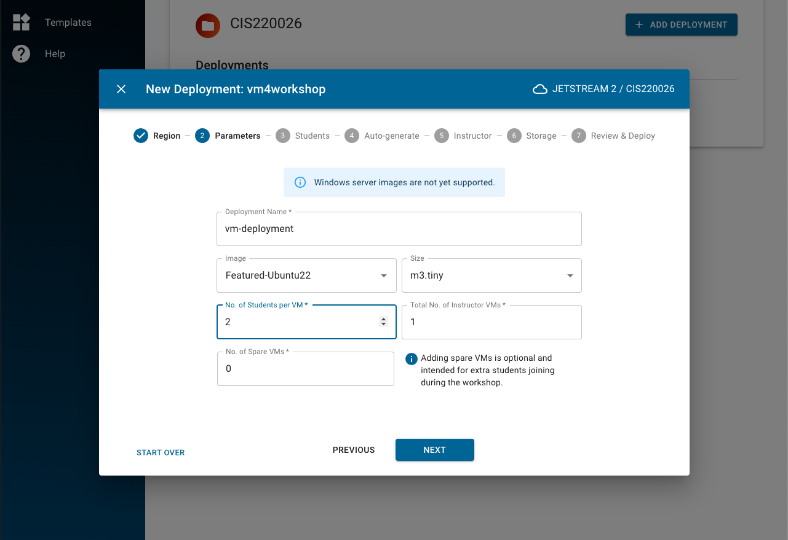
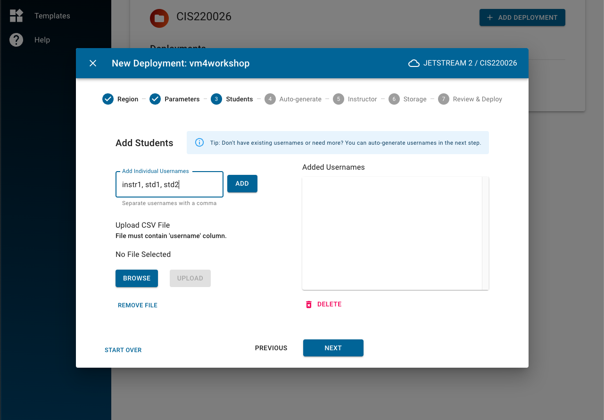
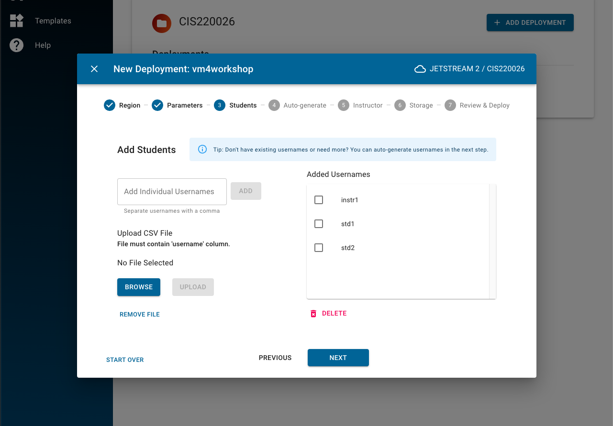

# Deploying Multiple VMs for workshops

From the deployment screen, select **launch instances for a workshop**

After selecting your region, the next step is to set parameters: give a descriptive name, select the deployment image and size, number of learners and instructors, and spare VMs (optional).

The next step is to set the usernames. This can be done manually through the left hand writable field (add with commas and spaces) or by uploading a CSV file. Clicking **ADD** (or **UPLOAD** if using a CSV) will show the added usernames on the right hand field. The "Added Usernames" field can be used to remove unwanted usernames.

After adding usernames, instructors are able to add their SSH key. You can only use ssh keys that have already been added to the Credentials -- read how to [here](https://docs.jetstream-cloud.org/ui/cacao/credentials/#adding-an-ssh-public-key), or how to create an ssh key [here](https://www.ssh.com/academy/ssh/keygen).

You can set a shared storage space as well. This shared storage will be visible and accessible through all the VMs that have been deployed through this method. Lastly, review your deployment and click submit to launch.

The launched screen looks like the following screenshot:

Upon launch, the instructor will receive a list of passwords and IP addresses that the users can use in order to connect via `ssh` from their own computers.
